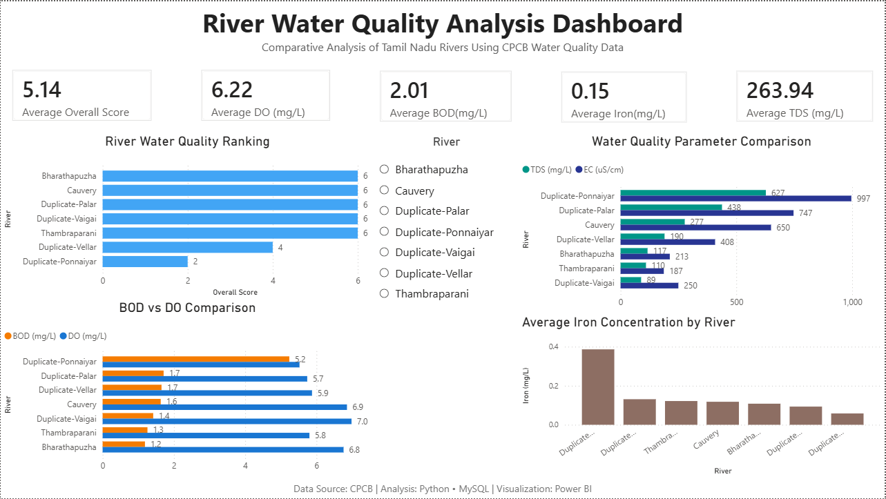
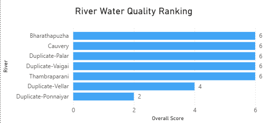
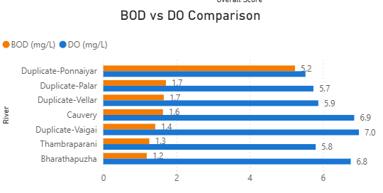

## 📌 Project Overview

This project evaluates the water quality of selected Tamil Nadu rivers using key environmental parameters such as:

- Biochemical Oxygen Demand (BOD)
- Dissolved Oxygen (DO)
- Total Dissolved Solids (TDS)
- Electrical Conductivity (EC)
- Iron Concentration
- pH

An overall water quality score was developed by comparing each parameter against standard permissible limits.

---

## 🎯 Objectives

- Clean and preprocess raw CPCB water quality datasets.
- Merge multiple datasets into a single analytical dataset.
- Perform exploratory data analysis (EDA).
- Calculate river-wise average water quality parameters.
- Develop an Overall Water Quality Score.
- Perform SQL-based analysis using MySQL.
- Build an interactive Power BI dashboard.

---

## 📊 Dashboard Preview






---

## 🛠️ Tools & Technologies

- Python
- Pandas
- NumPy
- MySQL
- SQL
- Power BI
- Jupyter Notebook
- Git & GitHub

---

## 📂 Project Structure

```
River-Water-Quality-Analysis/
│
├── data/
│   ├── raw_data.csv
│   └── cleaned_data.csv
│
├── notebook/
│   └── River_Quality_Analysis.ipynb
│
├── sql/
│   └── river_analysis.sql
│
├── powerbi/
│   └── River_Water_Quality_Dashboard.pbix
│
├── images/
│   └── dashboard.png
│
├── README.md
└── requirements.txt
```

---

## 🔄 Project Workflow

### 1. Data Collection

- CPCB Surface Water Quality datasets

### 2. Data Cleaning

- Removed duplicates
- Handled missing values
- Standardized column names
- Merged datasets

### 3. Exploratory Data Analysis

- River-wise statistics
- Parameter comparison
- Data validation

### 4. Water Quality Scoring

Each river was evaluated using standard permissible limits.

| Parameter | Standard |
|-----------|----------|
| BOD | ≤ 3 mg/L |
| DO | ≥ 5 mg/L |
| pH | 6.5–8.5 |
| TDS | ≤ 500 mg/L |
| EC | ≤ 1500 µS/cm |
| Iron | ≤ 0.3 mg/L |

Scoring Logic:

- Meets Standard → +1
- Exceeds Standard → -1
- Missing Value → 0

Overall Score = Sum of all parameter scores.

---

## 🗄️ SQL Analysis

The project includes SQL queries to:

- Calculate KPIs
- Rank rivers by Overall Score
- Compare water quality parameters
- Generate summary statistics

---

## 📈 Power BI Dashboard

The dashboard includes:

- KPI Cards
- River Water Quality Ranking
- BOD vs DO Comparison
- TDS vs EC Comparison
- Iron Concentration by River
- Interactive River Slicer

---

## 📌 Key Insights

- Bharathapuzha, Duplicate-Palar, Duplicate-Vaigai, Thambraparani and Cauvery achieved the highest overall water quality scores.
- Higher BOD values generally correspond to lower water quality.
- Rivers with higher Dissolved Oxygen exhibited better overall health.
- TDS and Electrical Conductivity showed noticeable variation across rivers.
- Iron concentrations remained within comparatively lower ranges.

---

## 📚 Dataset

Source:

Central Pollution Control Board (CPCB)

Surface Water Quality Monitoring Data

---

# 🌊 River Water Quality Analysis Dashboard

An end-to-end Data Analytics project that analyzes river water quality using CPCB (Central Pollution Control Board) water quality datasets. The project demonstrates data cleaning, SQL analysis, KPI creation, and interactive dashboard development using Python, MySQL, and Power BI.

---


## 👨‍💻 Author

**Shaurya Bothra**

Environmental Engineering Undergraduate

IIT (ISM) Dhanbad